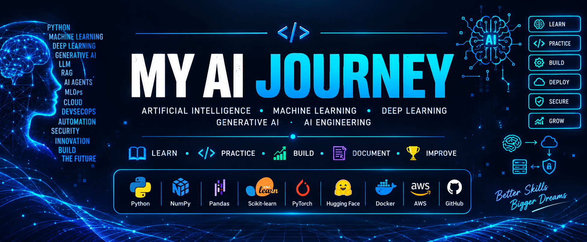

<p align="center">
  
</p>


                                                          #🤖 AI Engineer Journey

                      My personal journey of learning Artificial Intelligence from fundamentals to advanced AI engineering.

                                    🐍 Python • 🤖 Machine Learning • 🧠 Deep Learning • ✨ Generative AI

Welcome to my AI Engineer learning repository.

This repository documents my journey of learning Artificial Intelligence from the basics to advanced concepts. I created this repository to organize everything I learn, practice concepts through code, build AI projects, improve my problem-solving skills, and develop practical AI engineering skills.

---

# 🧠 What I Will Learn

My AI journey is organized from beginner to advanced topics.

## 🟢 AI & Programming Fundamentals

Python for AI - Python Fundamentals - Object-Oriented Programming - File Handling - Exception Handling - Virtual Environments - Mathematics for AI - Linear Algebra - Probability - Statistics - Calculus

## 🟢 Data & AI Libraries

NumPy - Arrays - Array Operations - Broadcasting - Pandas - DataFrames - Data Cleaning - Data Analysis - Matplotlib - Data Visualization - Exploratory Data Analysis

## 🟡 Machine Learning

Machine Learning Fundamentals - Features and Labels - Training and Testing - Supervised Learning - Unsupervised Learning - Regression - Classification - Clustering - Feature Engineering - Model Evaluation

## 🟡 Deep Learning

Neural Networks - Tensors - Activation Functions - Loss Functions - Backpropagation - Optimization - Deep Learning Fundamentals - PyTorch - Model Training - Model Evaluation

## 🟠 Natural Language Processing

Text Processing - Tokenization - Text Cleaning - Word Embeddings - Text Classification - NLP Models - Language Models

## 🔴 Generative AI

Generative AI Fundamentals - Transformers - Attention Mechanism - Large Language Models - Prompt Engineering - Embeddings - Vector Databases - Retrieval-Augmented Generation - AI Agents

## 🔴 AI Engineering

LLM Applications - AI APIs - RAG Applications - AI Agents - Model Integration - AI Application Development - API Development - AI Deployment

## ⚙️ MLOps & Deployment

Model Deployment - Docker - Git - GitHub - CI/CD - GitHub Actions - AWS - Cloud Deployment - Model Monitoring - ML/AI Lifecycle

## 🚀 AI Projects

Small AI Experiments - Machine Learning Projects - Deep Learning Projects - Generative AI Applications - RAG Applications - AI Agent Projects - End-to-End AI Applications

---

# 💻 Technologies & Tools

I will practice and build projects using:

🐍 Python

🔢 NumPy

🐼 Pandas

📊 Matplotlib

🤖 Scikit-learn

🔥 PyTorch

🤗 Hugging Face

🧠 LLM APIs

🗄️ Vector Databases

🐳 Docker

🔧 Git & GitHub

⚙️ GitHub Actions

☁️ AWS

---

# 📂 Repository Structure

```text
MY-AI-ENGINEER-JURNEY/
│
├── README.md
│
├── assets/
│   └── ai-journey-banner.png
│
├── 00_Repository_Guide/
│   ├── README.md
│   ├── AI_Roadmap.md
│   └── How_to_Use_This_Repository.md
│
├── 01_Python_For_AI/
├── 02_Mathematics_For_AI/
├── 03_NumPy/
├── 04_Pandas/
├── 05_Data_Visualization/
│
├── 06_Machine_Learning_Fundamentals/
├── 07_Supervised_Learning/
├── 08_Unsupervised_Learning/
├── 09_Model_Evaluation/
│
├── 10_Deep_Learning/
├── 11_PyTorch/
│
├── 12_Natural_Language_Processing/
├── 13_Transformers/
├── 14_Generative_AI/
├── 15_Large_Language_Models/
├── 16_Prompt_Engineering/
├── 17_Embeddings_Vector_Databases/
├── 18_RAG/
├── 19_AI_Agents/
│
├── 20_MLOps/
├── 21_AI_Projects/
├── 22_Interview_Preparation/
└── 23_Daily_Log/
